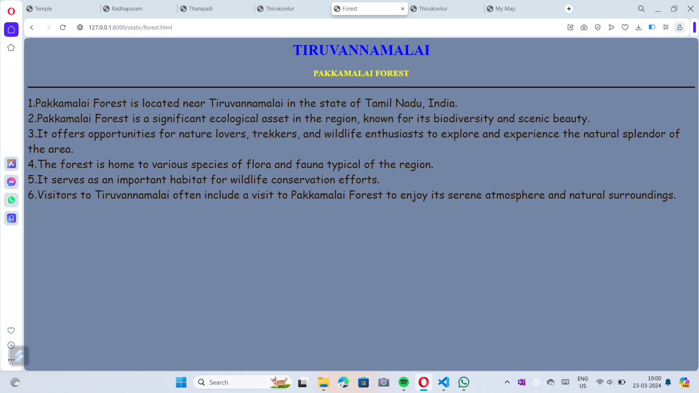
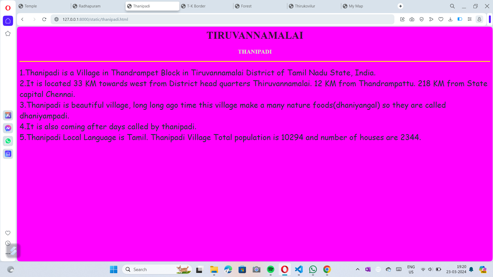
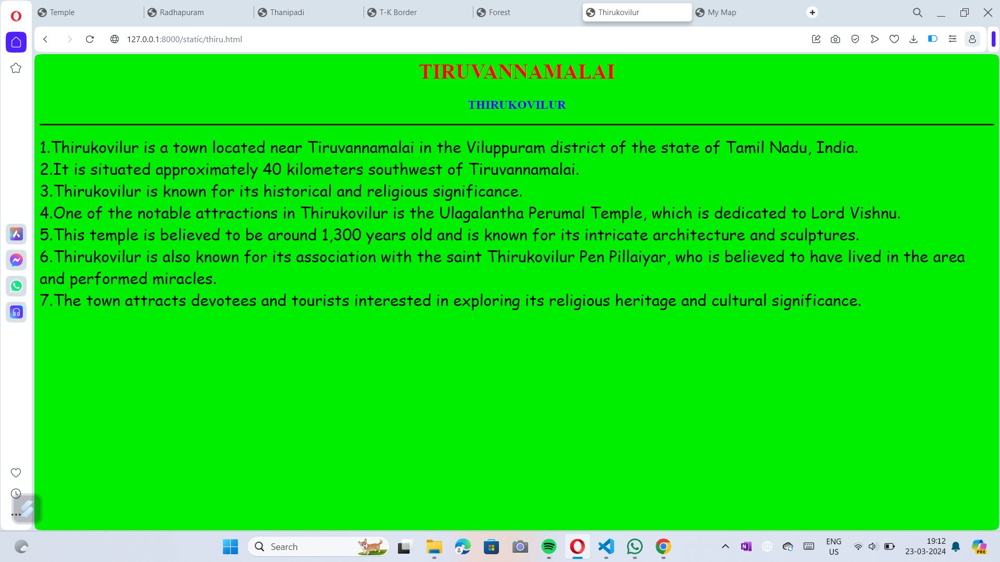
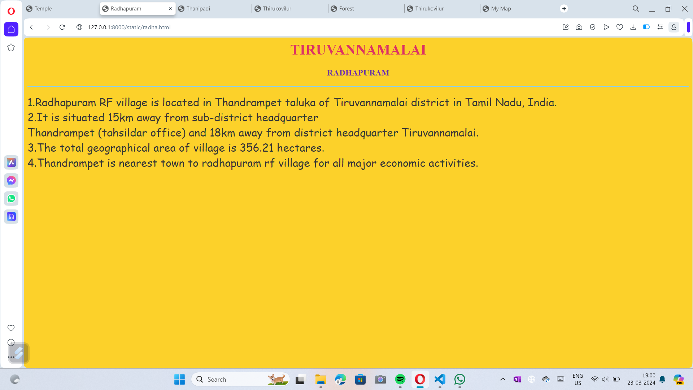
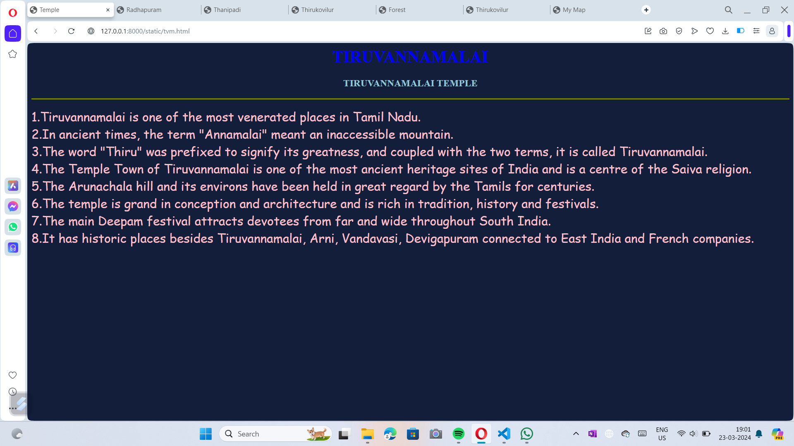

# Ex04 Places Around Me
## Date:23.03.2024 

## AIM
To develop a website to display details about the places around my house.

## DESIGN STEPS

### STEP 1
Create a Django admin interface.

### STEP 2
Download your city map from Google.

### STEP 3
Using ```<map>``` tag name the map.

### STEP 4
Create clickable regions in the image using ```<area>``` tag.

### STEP 5
Write HTML programs for all the regions identified.

### STEP 6
Execute the programs and publish them.

## CODE
```<html>
<head>
<title>My Map</title>
</head>
<body>
    <h1 align="center">
        <font color="ruby"><b>TIRUVANNAMALAI</b></font>
        </h1>
    <h3 align="center">
        <font color=blue"><b>A.MERCY (212223110027) </b></font>
        </h3>
    

    <map name="image-map">
        <area target="" alt="Thanipadi" title="Thanipadi" href="thanipadi.html" coords="191,406,122,369" shape="rect">
        <area target="" alt="Thirukoilure" title="Thirukoilure" href="thiru.html" coords="904,683,1040,723" shape="rect">
        <area target="" alt="Tiruvannamalai Kallakurichi Border" title="Tiruvannamalai Kallakurichi Border" href="t-k.html" coords="352,533,443,513,528,531,529,570,348,566" shape="poly">
        <area target="" alt="Pakkamalai Forest" title="Pakkamalai Forest" href="forest.html" coords="1160,246,74" shape="circle">
        <area target="" alt="Tiruvannamalai " title="Tiruvannamalai " href="tvm.html" coords="675,30,607,44,573,111,654,169,771,134,749,60,718,46,701,43" shape="poly">
        <area target="" alt="Radhapuram" title="Radhapuram" href="radha.html" coords="421,189,530,230" shape="rect">
    </map>
</body>
</html>


forest.html

<html>
    <head>
        <title>
            Forest
        </title>
    </head>
    <body bgcolor="#7285A5">
        <h1 align="center">
            <font color="blue"><b>TIRUVANNAMALAI</b></font>
        </h1>
        <h3 align="center">
            <font color="yellow"><b>PAKKAMALAI FOREST</b></font>
        </h3>
        <hr size="3" color="lemon">
        <p>
            <font face="comic Sans MS" color="#2b1700" size="5">
                1.Pakkamalai Forest is located near Tiruvannamalai in the state of Tamil Nadu, India. <br>
                2.Pakkamalai Forest is a significant ecological asset in the region, known for its biodiversity and scenic beauty.<br>
                3.It offers opportunities for nature lovers, trekkers, and wildlife enthusiasts to explore and experience the natural splendor of the area.<br>
                4.The forest is home to various species of flora and fauna typical of the region.<br>
                5.It serves as an important habitat for wildlife conservation efforts.<br>
                6.Visitors to Tiruvannamalai often include a visit to Pakkamalai Forest to enjoy its serene atmosphere and natural surroundings.<br>
            </font>
        </p>

    </body>
</html>


t-k.html

<html>
    <head>
        <title>
            Thirukovilur
        </title>
    </head>
    <body bgcolor="#73c2fb">
        <h1 align="center">
            <font color="#420d09"><b>TIRUVANNAMALAI</b></font>
        </h1>
        <h3 align="center">
            <font color="navy"><b>THIRUKOVILUR</b></font>
        </h3>
        <hr size="3" color="yellow">
        <p>
            <font face="comic Sans MS" color="#81007f" size="5">
                1.The border between Tiruvannamalai and Kallakurichi districts is a geographical demarcation separating the administrative jurisdictions of these two districts in the Indian state of Tamil Nadu.<br>
                2.Tiruvannamalai district, named after the town of Tiruvannamalai, is known for its religious significance due to the presence of the Annamalaiyar Temple<br>
                3.It is one of the largest temples dedicated to Lord Shiva. It is also home to various natural attractions, including forests and hills such as Pakkamalai Forest and Gingee Fort.<br>
                4.Kallakurichi district, on the other hand, is relatively newer as it was carved out of Villupuram district in 2019 as part of a reorganization of districts in Tamil Nadu.<br>
                5.The district headquarters is the town of Kallakurichi.<br>
                6.Kallakurichi is known for its agricultural activities, with paddy fields and sugarcane plantations being common sights in the region.  <br> 
            </font>
        </p>

    </body>
</html>


Thanipadi.html

<html>
<head>
<title>Thanipadi</title>
</head>
<body bgcolor="lime">
<h1 align="center">
<font color="navy"><b>TIRUVANNAMALAI</b></font>
</h1>
<h3 align="center">
<font color="#FF00FF"><b>THANIPADI</b></font>
</h3>
<hr  size="3" color="yellow">
<p>
<font  face="comic Sans MS" size="5" color="brown">
    1.Thanipadi is a Village in Thandrampet Block in Tiruvannamalai District of Tamil Nadu State, India.<br>
    2.It is located 33 KM towards west from District head quarters Thiruvannamalai. 12 KM from Thandrampattu. 218 KM from State capital Chennai.<br>
    3.Thanipadi is beautiful village, long long ago time this village make a many nature foods(dhaniyangal) so they are called dhaniyampadi.<br>
    4.It is also coming after days called by thanipadi.<br>
    5.Thanipadi Local Language is Tamil. Thanipadi Village Total population is 10294 and number of houses are 2344.<br>
</font>
</p>
</body>
</html>


thiru.html

<html>
    <head>
        <title>
            Thirukovilur
        </title>
    </head>
    <body bgcolor="steel">
        <h1 align="center">
            <font color="red"><b>TIRUVANNAMALAI</b></font>
        </h1>
        <h3 align="center">
            <font color="blue"><b>THIRUKOVILUR</b></font>
        </h3>
        <hr size="3" color="#2b1700">
        <p>
            <font face="comic Sans MS" color="black" size="5">
                
1.Thirukovilur is a town located near Tiruvannamalai in the Viluppuram district of the state of Tamil Nadu, India. <br>
2.It is situated approximately 40 kilometers southwest of Tiruvannamalai.<br>
3.Thirukovilur is known for its historical and religious significance.<br>
4.One of the notable attractions in Thirukovilur is the Ulagalantha Perumal Temple, which is dedicated to Lord Vishnu.<br>
5.This temple is believed to be around 1,300 years old and is known for its intricate architecture and sculptures.<br>
6.Thirukovilur is also known for its association with the saint Thirukovilur Pen Pillaiyar, who is believed to have lived in the area and performed miracles.<br>
7.The town attracts devotees and tourists interested in exploring its religious heritage and cultural significance.
            </font>
        </p>

    </body>
</html>


radha.html

<html>
<head>
<title>Radhapuram</title>
</head>
<body bgcolor="#fcd12a">
<h1 align="center">
<font color="#de3163"><b>TIRUVANNAMALAI</b></font>
</h1>
<h3 align="center">
<font color="#6f2da8"><b>RADHAPURAM</b></font>
</h3>
<hr  size="3" color="#89cfef">
<p>
<font  face="comic Sans MS" size="5" color="#363636">
    1.Radhapuram RF village is located in Thandrampet taluka of Tiruvannamalai district in Tamil Nadu, India. <br>
    2.It is situated 15km away from sub-district headquarter<br> Thandrampet (tahsildar office) and 18km away from district headquarter Tiruvannamalai.<br>
    3.The total geographical area of village is 356.21 hectares. <br>
    4.Thandrampet is nearest town to radhapuram rf village for all major economic activities.<br> 
</font>
</p>
</body>
</html>


tvm.html

<html>
<head>
<title>Temple</title>
</head>
<body bgcolor="#131E3A">
<h1 align="center">
<font color="blue"><b>TIRUVANNAMALAI</b></font>
</h1>
<h3 align="center">
<font color="#95c8d8"><b>TIRUVANNAMALAI TEMPLE</b></font>
</h3>
<hr align="justify" size="3" color="olive">
<p>
<font face="comic Sans MS" size="5" color="pink">
    1.Tiruvannamalai is one of the most venerated places in Tamil Nadu.<br>
    2.In ancient times, the term "Annamalai" meant an inaccessible mountain.<br>
    3.The word "Thiru" was prefixed to signify its greatness, and coupled with the two terms, it is called Tiruvannamalai.<br>
    4.The Temple Town of Tiruvannamalai is one of the most ancient heritage sites of India and is a centre of the Saiva religion.<br>
    5.The Arunachala hill and its environs have been held in great regard by the Tamils for centuries.<br>
    6.The temple is grand in conception and architecture and is rich in tradition, history and festivals.<br>
    7.The main Deepam festival attracts devotees from far and wide throughout South India.<br>
    8.It has historic places besides Tiruvannamalai, Arni, Vandavasi, Devigapuram connected to East India and French companies.<br>
</font>
</p>
</body>
</html>


 ```

## OUTPUT

### My Map:








## RESULT
The program for implementing image maps using HTML is executed successfully.
